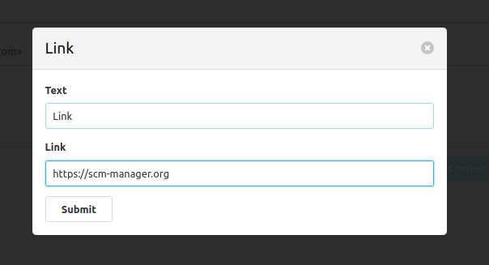

Um das Editieren einer Markdown Datei zu unterstützen, wird durch dieses Plugin ein Rich-Text-Editor angeboten, welcher mit Markdown-Dateien kompatibel ist.
Sobald dieses Plugin installiert ist, wird beim Bearbeiten einer Markdown-Datei innerhalb des SCM-Managers, stets dieser Editor verwendet.
Der Editor bietet unterschiedliche Formatierungsoptionen an, welche auch von Markdown unterstützt werden.
Im Folgenden wird noch genauer auf diese Optionen eingegangen.

## Toolbar

Der neue Editor ist mit einer Toolbar oberhalb des Text-Editor ausgestattet.
Diese Toolbar beinhaltet mehrere Buttons, mit denen die unterschiedlichen Formatierungsoptionen angewendet bzw entfernt werden können.
Dafür muss der Benutzer den zu formatierenden Text markieren und anschließend den jeweiligen Button betätigen.
Falls beim aktuell markierten Text bereits Formatierungen angewendet werden, werden diese in der Toolbar farblich hervorgehoben.

## Text-Editor

Unter der Toolbar befindet sich der eigentliche Text-Editor.
Hier können Benutzer ihre Markdown-Texte verfassen.
Alternativ zur Toolbar ist es auch möglich im Text-Editor direkt die Markdown-Syntax zu nutzen um Texte zu formatieren.
Beispielsweise kann ein Benutzer direkt eine Raute (`#`) und ein Leerzeichen eintippen,
um die aktuellen Zeile zu einer Überschrift erster Ordnung zu formatieren.

Im Text-Editor ist es möglich Tabs im Markdown-Text zu verwenden.
Damit sich Benutzer, die auf die Tastaturnavigation angewiesen sind, dennoch auf der Webseite weiter navigieren können,
ist es möglich mithilfe der Escape-Taste dieses Verhalten temporär abzustellen.
Dadurch ist es temporär nicht möglich Tabs im Markdown-Text zu verwenden, da das Drücken von Tab bzw. Shift-Tab verwendet wird,
um das nächste bzw. vorherige Element zu fokusieren.
Falls Tab wieder zur Eingabe und nicht mehr zur Navigation verwendet werden soll,
dann muss der Benutzer den Fokus wieder auf den Text-Editor setzen oder die Tastenkombination Strg-Enter betätigen.

## Formatierungsoptionen

Im Folgenenden werden die unterstützten Formatierungsoptionen aufgelistet und erläutert.
Dabei spiegelt die Reihenfolge der Optionen auch die Reihenfolge in der Toolbar wieder.

### Paragraph

Mit Paragraph wird ein einfacher zusammenhängender Textblock definiert.
Inline Formatierungen wie 
  - Fettschrift
  - Kursivschrift
  - durchgestrichene Texte
  - Links 
  - Inline Code 
können innerhalb eines Paragraphen zusätlich angewendet werden.

### Überschriften

Eine Zeile kann auch als eine Überschrift formatiert werden.
Dabei kann der Benutzer definieren, ob die Überschrift zur ersten bis hin zur sechsten Ordnung gehören soll.

### Ungeordnete Listen

Benutzer können auch ungeordnete Stichpunktartige Listen verwenden.
Dafür muss ein markierter Text als eine ungeordnete Liste mithilfe der Toolbar formatiert werden.

Zusätzlich können Listen-Elemente auch Ebenen ein- bzw rausgerückt werden.
Dafür muss zum Beginn des Textes des jeweiligen Listen-Elements die Tab bzw. Shift-Tab Taste betätigt werden.

### Nummerierte Listen

Die nummerierte Liste verhält sich analog zu der ungeordneten Liste,
nur das hier die einzelnen Elemente zusätzlich nummeriert werden.

### Zitate

Desweiteren bietet dieser Editor an, einen Textblock als Zitat zu definieren und hervorzuheben.

### Code-Blöcke

Ein Textblock kann auch als ein Block von Code-Zeilen definiert werden, wodurch dieser besonders hervorgehoben wird.

Zusätzlich ist es möglich die Sprache dieses Code-Blocks anzugeben.
Dafür muss das jeweilige Dropdown-Menü betätigt werden, welches in der Toolbar erscheint,
sobald der Cursor sich innerhalb eines Code-Blocks befindet.

Um aus einem Code-Block zu entkommen, 
kann man entweder mit dem Cursor zu einem anderen Text-Block springen oder die Enter-Taste drei mal hintereinander betätigen.

### Fett, kursiv und durchgestrichener Text

Markierter Text kann fett, kursiv oder durchgestrichen dargestellt werden.

### Links

Markierter Text kann auch verwendet werden, um daraus einen Link zu erstellen.
Dafür öffnet sich bei der Bedienung des jeweiligen Toolbar-Buttons ein Modal.
In diesem kann der Link als auch der Text, der als Link dargestellt werden soll, bearbeitet werden.

Falls kein Text markiert wurde und der Button für die Link-Formatierung betätigt wird,
öffnet sich ebenfalls das Modal, allerdings ist dann der Text für den Link leer.
Der Link wird hier dann an der Position des Cursors eingefügt.

### Inline Code

Sollte ein Benutzer keinen ganzen Block an Code benötigen, sondern den Code direkt im Fließtext integrieren wollen,
dann ist dies ebenfalls möglich.

### Horizontale Linien

Benutzer können ebenfalls eine horizontale Linie einfügen, welche eine eigene gesamte Zeile einnimmt.

### Bereinigen von Formatierungen

Um sämtliche Formatierungsoptionen von einem markierten Text zu entfernen,
bietet die Toolbar ebenfalls einen Button dafür an.

Hier sieht man zunächst bereits formatierten Text.

Nachdem Bereinigen der Formatierungen sieht der Text so aus.

