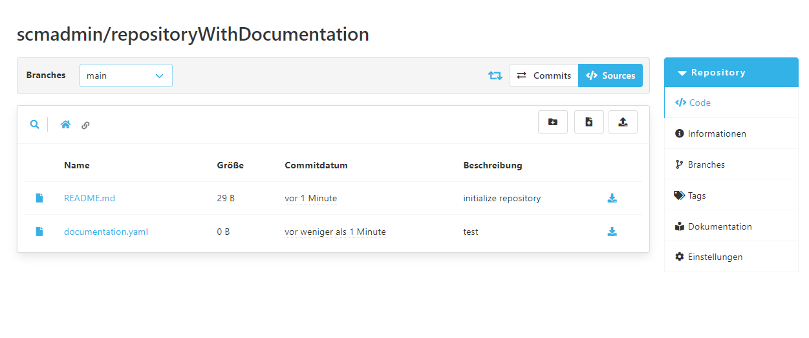

Das Documentation-Viewer Plugin vereinfacht das Verwalten einer Markdown-Dokumentation innerhalb eines Repositories.

## Konfiguration

Konfiguriert wird dieses Plugin über eine `documentation.yaml` Datei, welche sich im Root-Verzeichnis des jeweiligen Repositories befinden muss.
Alternativ ist auch eine `documentation.yml` erlaubt.
Es dürfen sich aber nicht beide Dateien im Root-Verzeichnis des Repositories befinden.



In dieser Yaml-Datei dürfen zwei Werte festgelegt werden.
Zum einen der `basePath` und die `landingPage`.
Der `basePath` legt den Pfad fest in dem die Dokumentation im Repository liegt.
Die `landingPage` ist der Dateiname der Startseite der Dokumentation.
Da hier lediglich eine Markdown-Dokumentation unterstützt wird, muss die Startseite ebenfalls eine Markdown-Datei sein (.md Endung).
Im Folgenden wird ein Beispielkonfiguration dargestellt:

```yaml
basePath: '/docs'
landingPage: 'home.md'
```

Diese Werte sagen aus, dass die Dokumentation unter `/docs` liegt und das sich darin die Startseite mit dem Namen `home.md` befindet.
Beide Werte sind Optional und müssen nicht gesetzt werden.
Falls die Werte nicht gesetzt sind, wird ein Default-Wert genutzt.
Die Default-Werte können dem oben genannten Beispiel entnommen werden.

## Aufrufen der Dokumentation

Sobald das Plugin konfiguriert wurde, erscheint in der Repository-Navigation ein weiterer Eintrag.
Dieser kann geklickt werden, um direkt zur Startseite der Dokumentation zu springen.


