To improve the editing of a Markdown file, this plugin provides a rich text editor that is compatible with Markdown files.
As soon as this plugin is installed, this editor is always used when editing a Markdown file within the SCM-Manager.
The editor offers various formatting options, which are also supported by Markdown.
These options are described in more detail below.

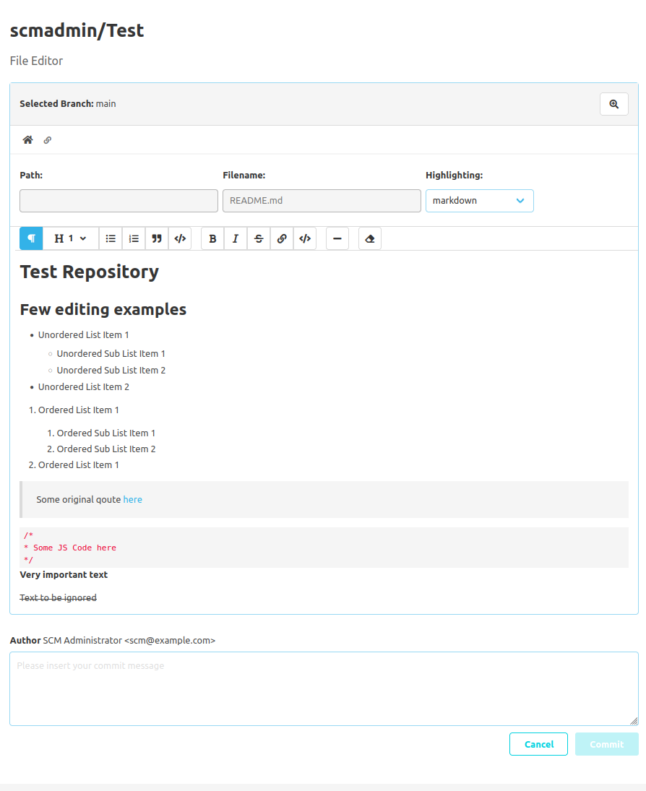

## Toolbar

The new editor is equipped with a toolbar above the text editor.
This toolbar contains several buttons with which the various formatting options can be applied or removed.
To do this, the user must select the text to be formatted and then click on the respective button.
If formatting is already applied to the currently selected text, then the respective buttons will be highlighted in the toolbar.

## Text editor

The actual text editor is located below the toolbar.
Users can write their Markdown texts here.
As an alternative to the toolbar, it is also possible to use the Markdown syntax directly in the text editor to format texts.
For example, a user can directly type in a hash (`#`) and a space,
to format the current line into a first-order heading.

In the text editor, it is possible to use tabs in the Markdown text.
So that users who rely on keyboard navigation can still navigate the website,
it is possible to temporarily disable this behavior using the escape key.
This means that it is temporarily not possible to use tabs in the Markdown text, as pressing tab or shift tab is used to move the focus on the next or previous element.
If tab is to be used again for input and no longer for navigation,
then the user must set the focus back to the text editor or press the key combination ctrl enter.

## Formatting options

The supported formatting options are listed and explained below.
The order of the options also reflects the order in the toolbar.

### Paragraph

A paragraph defines a simple contiguous block of text.
Inline formatting such as
- bold
- italics
- strikethrough text
- links
- inline code
can also be used within a paragraph.

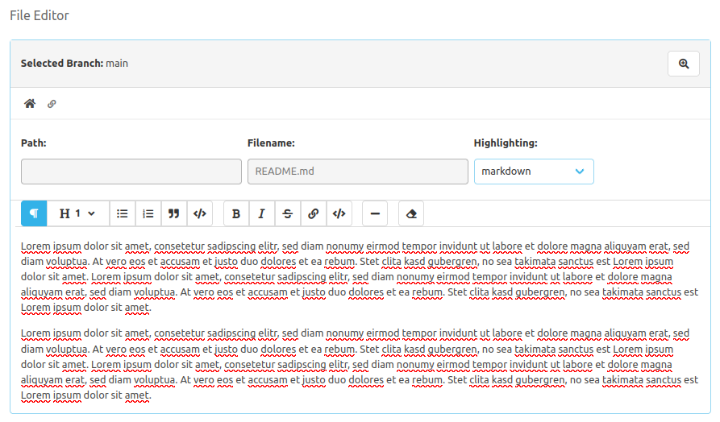

### Headings

A text line can also be formatted as a heading.
The user can define whether the heading should belong to the first through to the sixth order.

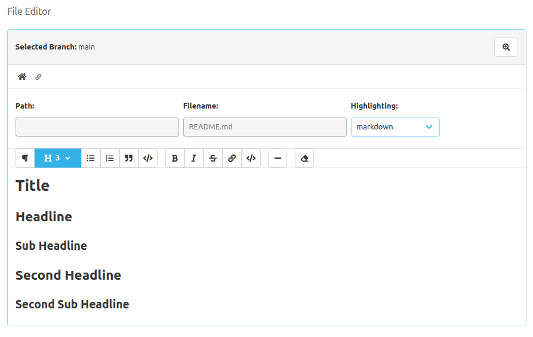

### Unordered lists

Users can also use unordered bullet point lists.
To do this, a selected text must be formatted as an unordered list using the toolbar.

In addition, list elements can also be indented or outdented.
To do this, the tab or shift tab key must be pressed at the beginning of the text of the respective list element item.

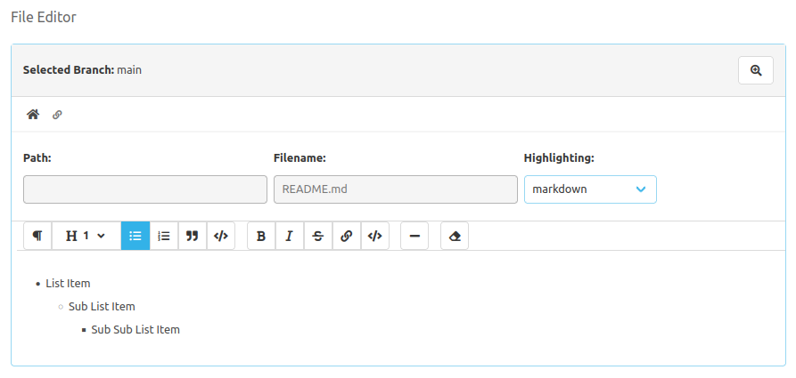

### Numbered lists

The numbered list behaves in the same way as the unordered list,
except that the individual elements are also numbered here.

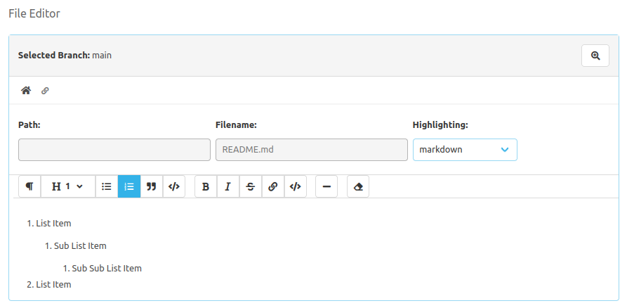

### Quotes

This editor also offers the option of defining and highlighting a text block as a quote.

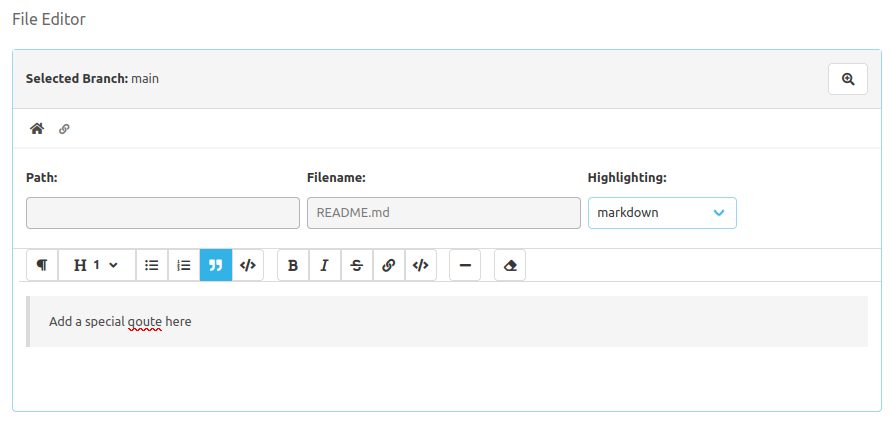

### Code blocks

A text block can also be defined as a block of code, which will be highlighted as such.

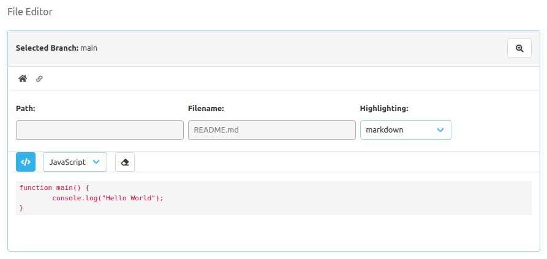

It is also possible to specify the language of this code block.
To do this, click on the respective drop-down menu that appears in the toolbar,
as soon as the cursor is within a code block.

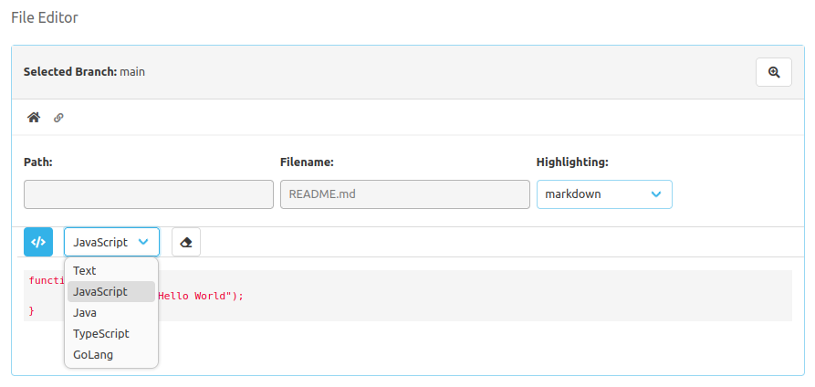

To escape from a code block,
you can either use the cursor to jump to another text block or press the enter key three times in succession.

### Bold, italic and strikethrough text

Selected text can be displayed in bold, italics or strikethrough.

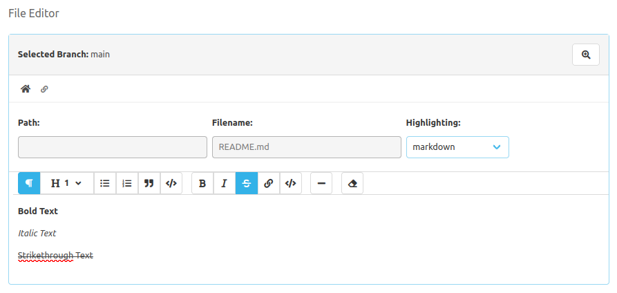

### Links

Marked text can also be used to create a link.
To do this, a modal opens when the respective toolbar button is clicked.
The link as well as the text that is to be displayed as a link can be edited in this modal.

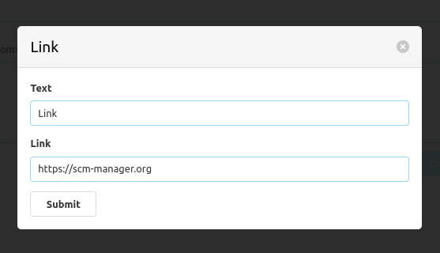

If no text has been selected and the button for link formatting is clicked,
the modal also opens, but the text for the link is then empty.
The link is then inserted at the position of the cursor.

### Inline code

If a user does not need a whole block of code, but wants to integrate the code directly into a line of text,
then this is also possible.

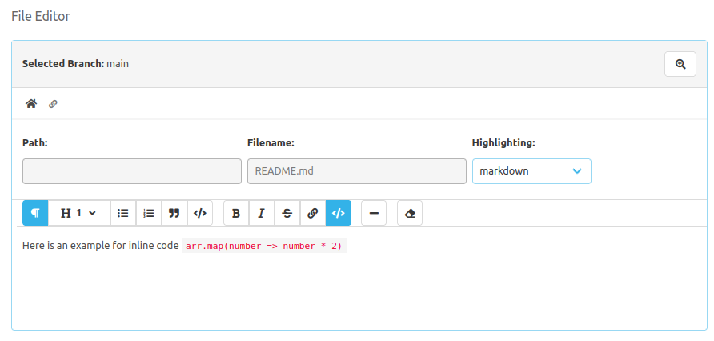

### Horizontal lines

Users can also insert a horizontal line, which takes up an entire line of its own.

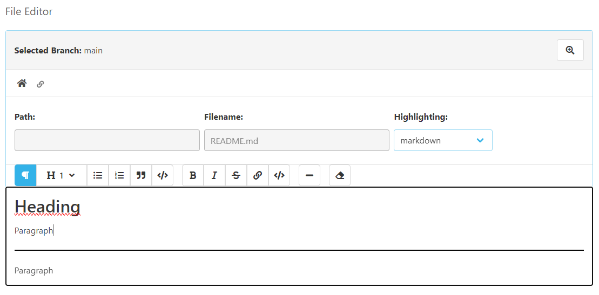

### Clean up formatting

To remove all formatting options from a selected text,
the toolbar also offers a button for this.

Here you can first see already formatted text.

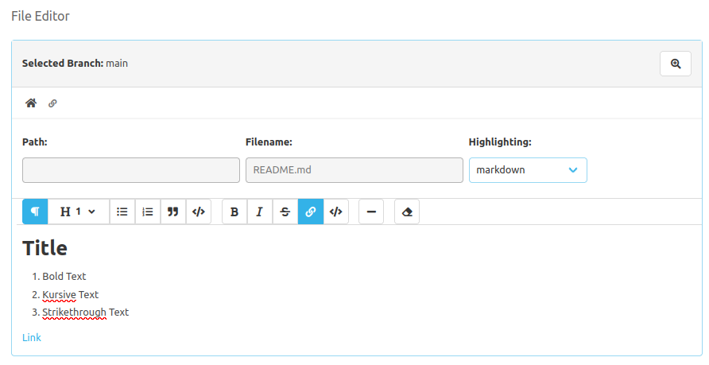

After cleaning up the formatting, the text looks like this.

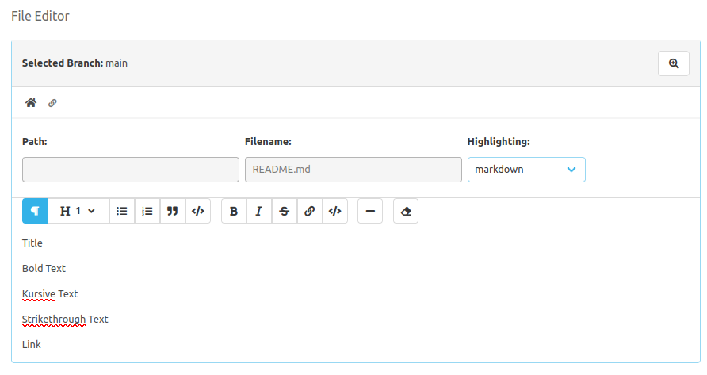
