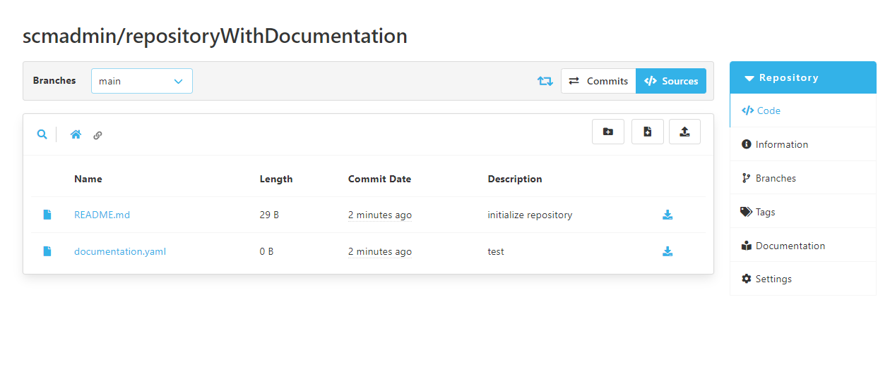

The documentation viewer plugin eases the management of a markdown based documentation contained within a repository.

## Configuration

The configuration of this plugin is done via a `documentation.yaml` file, contained in the root directory of the corresponding repository.
Alternatively it is also possible to use a `documentation.yml` file instead.
But it is not allowed to have both files in the root directory of the repository.



In this yaml file a user can configure two properties.
The first one is `basePath`.
`basePath` allows the user to determine in which directory of the repository the documentation is stored.
The second one is `landingPage`.
This allows the user to determine which file in the documentation directory is the landing page of the documentation.
Since this plugin only supports markdown files, the name of the landing page needs to have `.md` as a file extension.
The following shows an example configuration:

```yaml
basePath: '/docs'
landingPage: 'home.md'
```

With this configuration, the plugin assumes, that the documentation is stored under the `/docs` directory of the repository.
It also assumes the `home.md` file is supposed to be present at that directory and should be used as a landing page.
Both values are optional and are not required to be set.
If they are not set, a default value will be used.
The default values can also be seen in the example above.

## Accessing the documentation

As soon the plugin is configured properly, a navigation link to the documentation appears.
This navigation link can be seen in the repository side bar navigation.
By clicking this link, the user gets redirected to the landing page.


